# Weather Prediction Using Machine Learning

[](https://wheather-prediction.onrender.com/)


WeatherML is a standalone Python AIML weather prediction web app. It lets a user search any city, district, airport, or region, resolves the place with live geocoding, pulls current and future forecast data, and renders a multi-page dashboard with model confidence, forecast charts, model comparison, feature importance, and pipeline status.

Developed by Vishnu Vardhan Burri. All rights reserved.

Live demo: [https://wheather-prediction.onrender.com/](https://wheather-prediction.onrender.com/)

Install guide: [https://wheather-prediction.onrender.com/install.html](https://wheather-prediction.onrender.com/install.html)

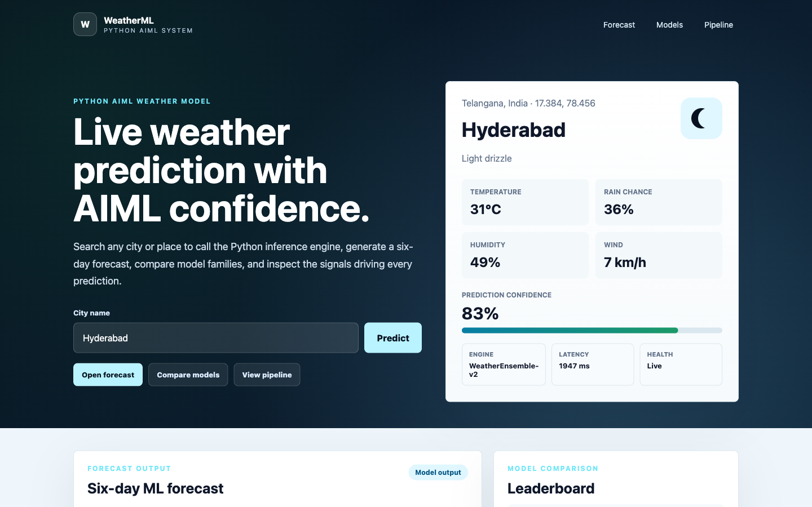

## Real-Time Test

The app was tested against live place search and forecast data from the Python API.

```bash
curl "http://127.0.0.1:4173/api/search?q=Visakhapatnam"
curl "http://127.0.0.1:4173/api/predict?city=Visakhapatnam"
```

Live forecast UI:

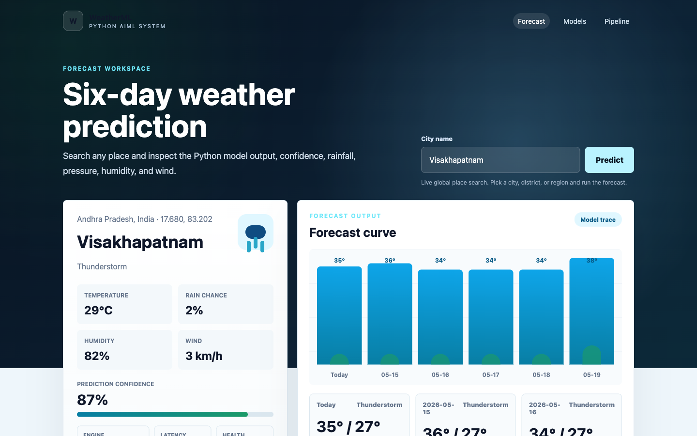

## Why We Built This

Most beginner weather prediction projects stop at a notebook or a basic form. This project turns the idea into a usable web application:

- real place search instead of fixed city buttons
- live forecast ingest instead of only static sample data
- Python AIML scoring layer instead of frontend-only calculations
- separate pages for forecast, models, and pipeline
- explainability output so users can see why the prediction looks the way it does
- mobile-first navigation, installable PWA support, and Docker-ready deployment

## Features

- Live global search through `/api/search`
- 14-day future forecast through `/api/predict`
- Deployment health check through `/api/health`
- Historical model registry through `/api/model-registry`
- Multi-page frontend: Home, Forecast, Models, Pipeline
- Hourly forecast page for the next 24 hours
- Weather risk alerts for storms, heavy rain, wind, and heat
- Location map page with OpenStreetMap handoff
- Explanation page showing why confidence/risk changes
- Compare two cities side by side
- Cinematic weather timeline mode
- Printable report page and JSON export
- Shareable PNG forecast card
- Browser voice briefing
- Dark, light, and satellite theme switch
- Metric/imperial unit switch for temperature, wind, pressure, charts, cards, and voice/share outputs
- Installable PWA shell with service worker caching for repeat visits
- Cross-platform install guide for Windows, macOS, Android, iPhone, and iPad
- Mobile bottom navigation for Forecast, Hourly, Alerts, Map, and Saved pages
- Python-side API response caching for repeated live forecast/geocoding calls
- Historical training pipeline using Open-Meteo archive data
- Model registry with train/test rows, MAE, RMSE, R², and feature weights
- Favorites and recent city shortcuts in browser storage
- Current weather card with temperature, rain chance, humidity, wind, confidence, latency, and health
- Forecast chart and day cards
- Model leaderboard for Decision Tree, KNN, Logistic Regression, and Gradient Boosting
- Feature-importance panel
- Per-model temperature trace
- Pipeline status view
- No API key required
- No third-party Python dependencies required

## Screens

| Forecast | Models |
| --- | --- |
|  | 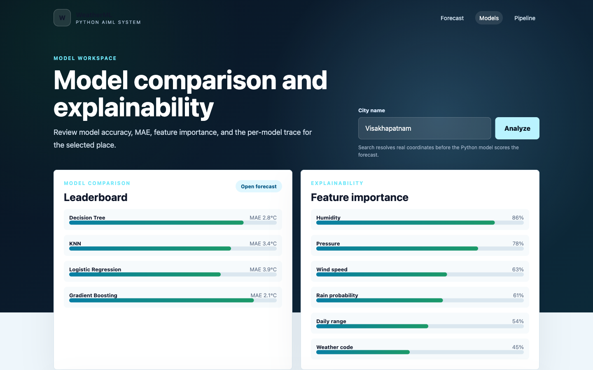 |

| Hourly | Alerts |
| --- | --- |
| 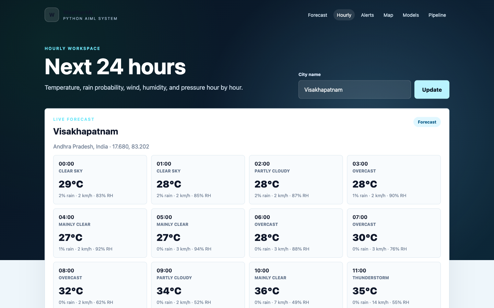 | 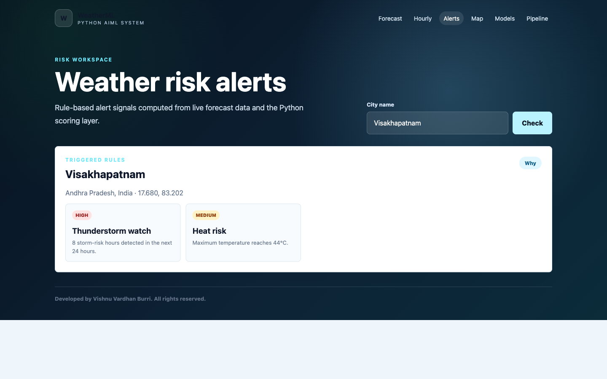 |

| Map | Explanation |
| --- | --- |
|  |  |

| Compare | Timeline |
| --- | --- |
| 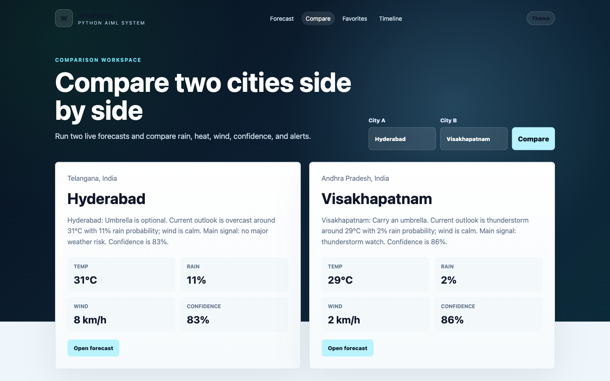 | 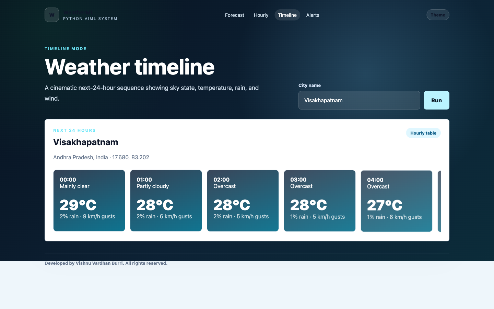 |

| Favorites | Report |
| --- | --- |
| 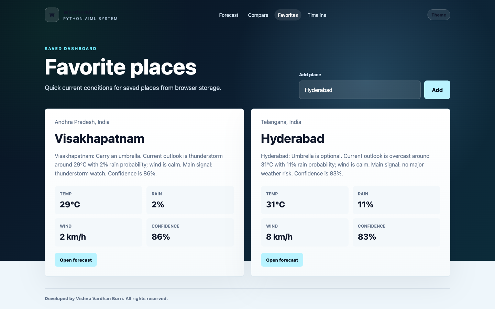 |  |

| Mobile Forecast | About / Live Demo |
| --- | --- |
| 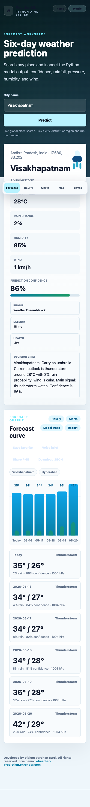 | 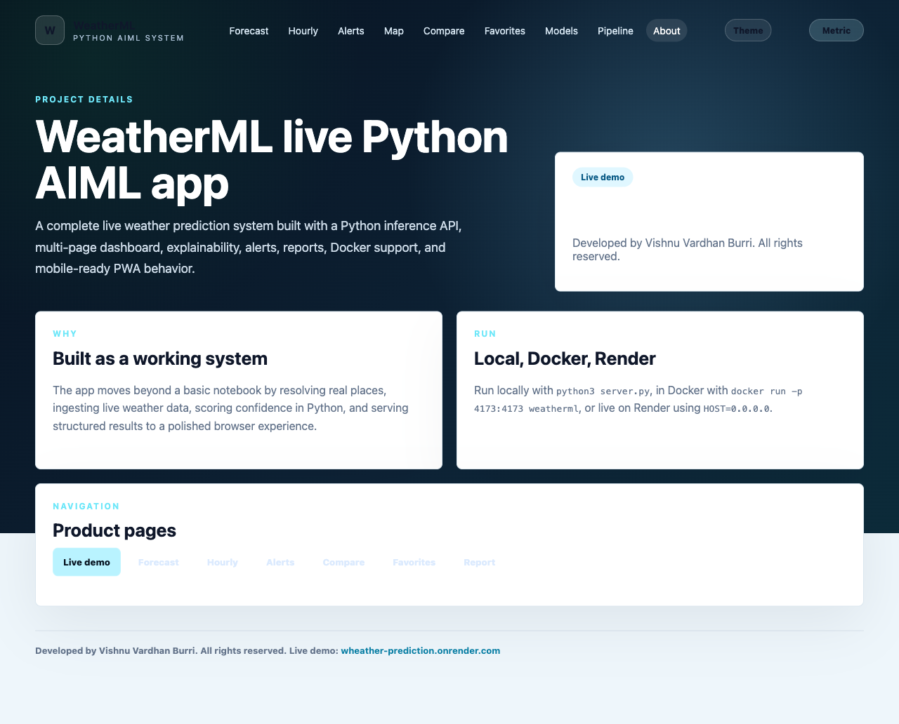 |

| Pipeline |
| --- | --- |
|  |

| Architecture |
| --- | --- |
| 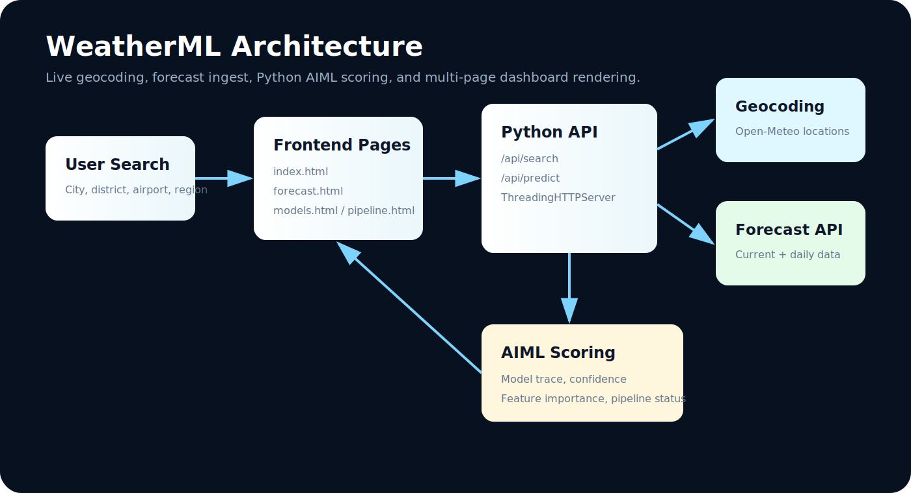 |

## Architecture

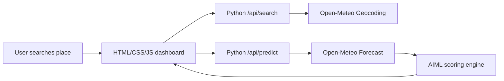

Full architecture notes: [docs/architecture.md](docs/architecture.md)

Human review docs:

- [Project story](docs/project-story.md)
- [Limitations](docs/limitations.md)
- [Testing report](docs/testing-report.md)
- [Demo script](docs/demo-script.md)
- [Viva questions](docs/viva-questions.md)

## Project Structure

```text
weather-prediction-ml/
  frontend/                        # Static browser app served at /
    index.html                     # Home/search page
    forecast.html                  # Forecast dashboard
    hourly.html                    # 24-hour forecast view
    alerts.html                    # Weather risk alerts
    map.html                       # Location map and coordinates
    explanation.html               # Model explanation page
    compare.html                   # City-to-city comparison
    timeline.html                  # Cinematic hourly timeline
    favorites.html                 # Saved places dashboard
    about.html                     # Live demo and project details
    install.html                   # Cross-platform PWA install guide
    training.html                  # Historical training and evaluation page
    notes.html                     # Human project notes and learning record
    report.html                    # Printable/downloadable report
    models.html                    # Models and explainability page
    pipeline.html                  # Pipeline status page
    script.js                      # Frontend API calls and rendering
    styles.css                     # UI styling
    manifest.webmanifest           # PWA install metadata
    service-worker.js              # Offline shell cache
    artifacts/training/            # Model card, metrics, predictions, weights
  backend/aiml/weather_engine.py   # Geocoding, forecast ingest, AIML scoring
  backend/aiml/training_pipeline.py # Historical archive training pipeline
  backend/aiml/model_registry.json # Generated model benchmark registry
  server.py                        # Python HTTP server and API routes
  media/                           # README screenshots and architecture image
  docs/                            # Architecture, API, and deployment notes
    quality-checklist.md           # Demo/deploy readiness checklist
    training.md                    # Historical training workflow
    project-story.md               # Why this project exists
    limitations.md                 # Honest scope and limitations
    testing-report.md              # Manual/CI/Docker/Render test record
    demo-script.md                 # Walkthrough script for review
    viva-questions.md              # Viva/interview preparation
  tests/smoke_test.py              # Basic backend smoke test
  Dockerfile                       # Container deployment
  LICENSE                          # All rights reserved license notice
  SECURITY.md                      # Vulnerability reporting and security notes
  CONTRIBUTING.md                  # Local setup and contribution standard
  CHANGELOG.md                     # Release notes
  .env.example                     # Local environment example
  .dockerignore                    # Docker build hygiene
  .github/workflows/smoke-test.yml # GitHub Actions smoke test
```

## How To Run

Requires Python 3.10+.

```bash
cd weather-prediction-ml
python3 server.py
```

Open:

```text
http://127.0.0.1:4173
```

Live:

```text
https://wheather-prediction.onrender.com/
```

## Where To Run

You can run it:

- locally on macOS, Windows, or Linux
- in a classroom or portfolio demo
- on a small VPS
- behind Nginx/Caddy for a public deployment
- inside Docker or a Python process manager later

Deployment notes: [docs/deployment.md](docs/deployment.md)

## Make It Live

### Option 1: Render

Live project URL:

```text
https://wheather-prediction.onrender.com/
```

1. Push this repo to GitHub.
2. Open Render and create a new Web Service from the GitHub repo.
3. Use these settings:
   - Runtime: `Python`
   - Build command: `pip install -r requirements.txt`
   - Start command: `python3 server.py`
   - Environment variable: `HOST=0.0.0.0`
4. Render provides `PORT` automatically, and `server.py` reads it from the environment.
5. After deploy, open the generated `.onrender.com` URL.

### Option 2: Railway

1. Create a Railway project from the GitHub repo.
2. Set start command:

```bash
python3 server.py
```

3. Add environment variable:

```text
HOST=0.0.0.0
```

4. Railway provides `PORT`; the server reads it automatically.

### Option 3: VPS

```bash
git clone https://github.com/vishnuvardhanburri/Wheather-prediction.git
cd Wheather-prediction
HOST=0.0.0.0 PORT=4173 python3 server.py
```

Then put Nginx or Caddy in front of port `4173` for HTTPS.

## API

Search places:

```bash
curl "http://127.0.0.1:4173/api/search?q=Visakhapatnam"
```

Predict weather:

```bash
curl "http://127.0.0.1:4173/api/predict?city=Visakhapatnam"
```

API reference: [docs/api.md](docs/api.md)

## Test

```bash
python3 -m py_compile server.py backend/aiml/weather_engine.py
node --check frontend/script.js
node --check frontend/service-worker.js
python3 tests/smoke_test.py
```

## Train Historical Models

The training pipeline pulls historical daily weather data, builds next-day high-temperature features, evaluates baseline and regression models, and writes `backend/aiml/model_registry.json`.

```bash
python3 backend/aiml/training_pipeline.py --city Hyderabad --days 730
```

The generated registry powers the Models page and `/api/model-registry`.

Generated review artifacts:

- `frontend/artifacts/training/model-card.md`
- `frontend/artifacts/training/metrics.json`
- `frontend/artifacts/training/predictions.csv`
- `frontend/artifacts/training/feature_weights.csv`

## Docker

```bash
docker build -t weatherml .
docker run --rm -p 4173:4173 weatherml
```

## Data Source

The app uses Open-Meteo services:

- Geocoding API for place search
- Forecast API for current and daily weather data
- Historical Weather API for offline model benchmark training

The Python layer computes model traces, confidence, feature importance, and pipeline metadata from the live forecast response.
