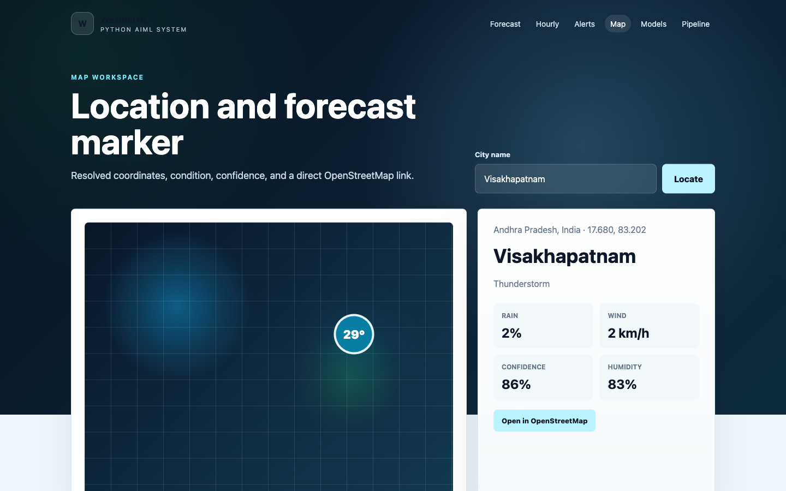
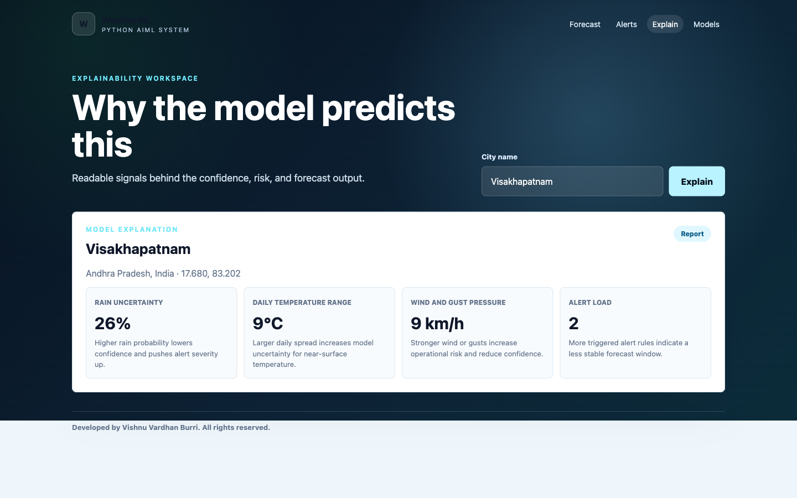
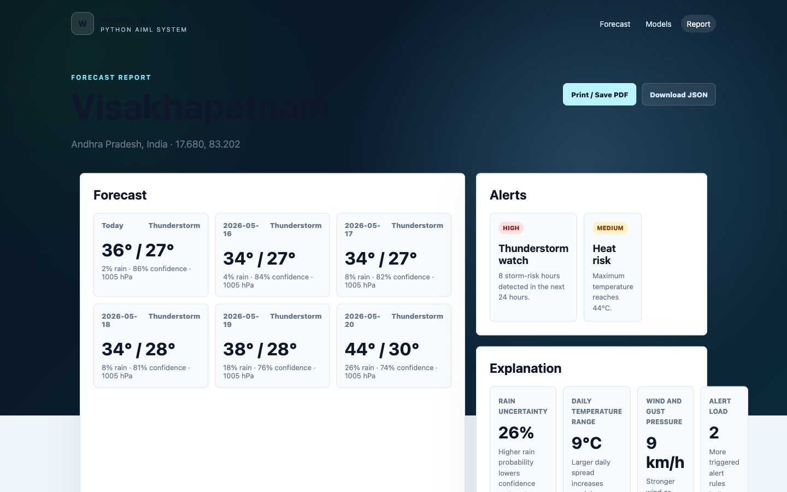
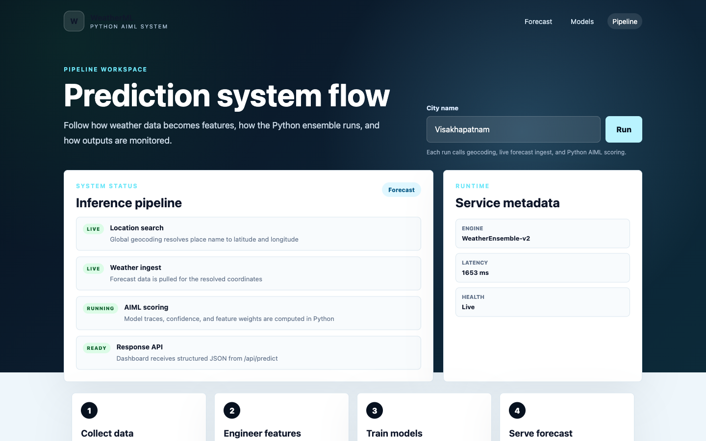
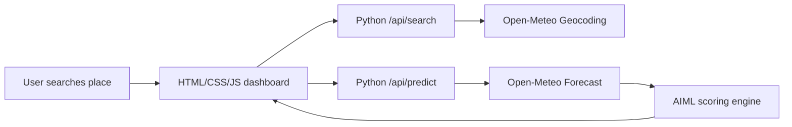

# Weather Prediction Using Machine Learning

WeatherML is a standalone Python AIML weather prediction web app. It lets a user search any city, district, airport, or region, resolves the place with live geocoding, pulls current forecast data, and renders a multi-page dashboard with model confidence, forecast charts, model comparison, feature importance, and pipeline status.

Developed by Vishnu Vardhan Burri. All rights reserved.


## Real-Time Test

The app was tested against live place search and forecast data from the Python API.

```bash
curl "http://127.0.0.1:4173/api/search?q=Visakhapatnam"
curl "http://127.0.0.1:4173/api/predict?city=Visakhapatnam"
```

Live forecast UI:


## Why We Built This

Most beginner weather prediction projects stop at a notebook or a basic form. This project turns the idea into a usable web application:

- real place search instead of fixed city buttons
- live forecast ingest instead of only static sample data
- Python AIML scoring layer instead of frontend-only calculations
- separate pages for forecast, models, and pipeline
- explainability output so users can see why the prediction looks the way it does

## Features

- Live global search through `/api/search`
- Six-day forecast through `/api/predict`
- Multi-page frontend: Home, Forecast, Models, Pipeline
- Hourly forecast page for the next 24 hours
- Weather risk alerts for storms, heavy rain, wind, and heat
- Location map page with OpenStreetMap handoff
- Explanation page showing why confidence/risk changes
- Printable report page and JSON export
- Favorites and recent city shortcuts in browser storage
- Current weather card with temperature, rain chance, humidity, wind, confidence, latency, and health
- Forecast chart and day cards
- Model leaderboard for Decision Tree, KNN, Logistic Regression, and Gradient Boosting
- Feature-importance panel
- Per-model temperature trace
- Pipeline status view
- No API key required
- No third-party Python dependencies required

## Screens

| Forecast | Models |
| --- | --- |
|  |  |

| Hourly | Alerts |
| --- | --- |
|  |  |

| Map | Explanation |
| --- | --- |
|  |  |

| Report | Pipeline |
| --- | --- |
|  |  |

| Architecture |
| --- | --- |
|  |

## Architecture



Full architecture notes: [docs/architecture.md](docs/architecture.md)

## Project Structure

```text
weather-prediction-ml/
  backend/aiml/weather_engine.py   # Geocoding, forecast ingest, AIML scoring
  server.py                        # Python HTTP server and API routes
  index.html                       # Home/search page
  forecast.html                    # Forecast dashboard
  hourly.html                      # 24-hour forecast view
  alerts.html                      # Weather risk alerts
  map.html                         # Location map and coordinates
  explanation.html                 # Model explanation page
  report.html                      # Printable/downloadable report
  models.html                      # Models and explainability page
  pipeline.html                    # Pipeline status page
  script.js                        # Frontend API calls and rendering
  styles.css                       # UI styling
  docs/                            # Architecture, API docs, screenshots
  tests/smoke_test.py              # Basic backend smoke test
  Dockerfile                       # Container deployment
  .github/workflows/smoke-test.yml # GitHub Actions smoke test
```

## How To Run

Requires Python 3.10+.

```bash
cd weather-prediction-ml
python3 server.py
```

Open:

```text
http://127.0.0.1:4173
```

## Where To Run

You can run it:

- locally on macOS, Windows, or Linux
- in a classroom or portfolio demo
- on a small VPS
- behind Nginx/Caddy for a public deployment
- inside Docker or a Python process manager later

Deployment notes: [docs/deployment.md](docs/deployment.md)

## Make It Live

### Option 1: Render

1. Push this repo to GitHub.
2. Open Render and create a new Web Service from the GitHub repo.
3. Use these settings:
   - Runtime: `Python`
   - Build command: `pip install -r requirements.txt`
   - Start command: `python3 server.py`
   - Environment variable: `HOST=0.0.0.0`
4. Render provides `PORT` automatically, and `server.py` reads it from the environment.
5. After deploy, open the generated `.onrender.com` URL.

### Option 2: Railway

1. Create a Railway project from the GitHub repo.
2. Set start command:

```bash
python3 server.py
```

3. Add environment variable:

```text
HOST=0.0.0.0
```

4. Railway provides `PORT`; the server reads it automatically.

### Option 3: VPS

```bash
git clone https://github.com/vishnuvardhanburri/Wheather-prediction.git
cd Wheather-prediction
HOST=0.0.0.0 PORT=4173 python3 server.py
```

Then put Nginx or Caddy in front of port `4173` for HTTPS.

## API

Search places:

```bash
curl "http://127.0.0.1:4173/api/search?q=Visakhapatnam"
```

Predict weather:

```bash
curl "http://127.0.0.1:4173/api/predict?city=Visakhapatnam"
```

API reference: [docs/api.md](docs/api.md)

## Test

```bash
python3 tests/smoke_test.py
```

## Docker

```bash
docker build -t weatherml .
docker run --rm -p 4173:4173 weatherml
```

## Data Source

The app uses Open-Meteo services:

- Geocoding API for place search
- Forecast API for current and daily weather data

The Python layer computes model traces, confidence, feature importance, and pipeline metadata from the live forecast response.
