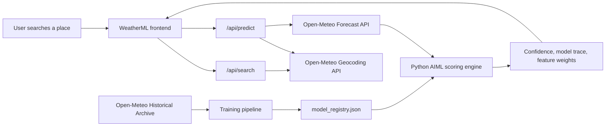

# Architecture

WeatherML is a standalone Python AIML weather prediction app. The frontend lives in `frontend/` as static HTML/CSS/JS, while the backend is a Python HTTP server that exposes weather search and prediction APIs and serves the frontend at root URLs.

## System Diagram

## Runtime Flow

1. User enters a city, district, airport, or region.
2. The frontend calls `/api/search?q=<place>` for live location suggestions.
3. On submit, the frontend redirects to `/forecast.html?city=<place>`.
4. `/api/predict?city=<place>` resolves coordinates, fetches forecast data, and runs Python scoring.
5. The dashboard renders current weather, six-day forecast, confidence, model trace, features, and pipeline status.
6. Secondary pages reuse the same `/api/predict` payload to render hourly forecast, alerts, map, explanations, and printable reports.
7. The optional training pipeline fetches Open-Meteo historical archive data and writes `backend/aiml/model_registry.json`.

## Pages

- `frontend/index.html`: landing and search entry.
- `frontend/forecast.html`: forecast dashboard.
- `frontend/hourly.html`: next-24-hour forecast.
- `frontend/alerts.html`: rule-based weather risk view.
- `frontend/map.html`: coordinate and map handoff.
- `frontend/explanation.html`: model explanation signals.
- `frontend/report.html`: printable forecast report and JSON export.
- `frontend/models.html`: model comparison, feature importance, per-model trace.
- `frontend/pipeline.html`: service flow, API/runtime metadata, pipeline status.

## Backend Modules

- `server.py`: HTTP server and API routing.
- `backend/aiml/weather_engine.py`: geocoding, forecast ingest, AIML scoring, model metadata, explainability payload.
- `backend/aiml/training_pipeline.py`: historical archive training and benchmark registry generation.
- `backend/aiml/model_registry.json`: generated model benchmark metrics consumed by the API and Models page.

## External APIs

- Open-Meteo Geocoding API: resolves place names into coordinates.
- Open-Meteo Forecast API: provides current and six-day weather data.
- Open-Meteo Historical Weather API: provides archive data for model benchmark training.

Both APIs can be used without an API key.
