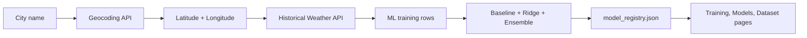

# Dataset Implementation Guide

WeatherML uses two kinds of weather data:

- Live forecast data for the running app.
- Historical archive data for model training and evaluation.

The training dataset is generated by code, not manually copied into the repo. This keeps the project explainable and repeatable.

## Data Source

WeatherML uses Open-Meteo because it does not require an API key for this workflow.

- Geocoding API: converts a city name into latitude and longitude.
- Forecast API: powers the live app.
- Historical Weather API: creates the training dataset.

## Training Target

The current training target is:

```text
next_day_temperature_2m_max_celsius
```

That means each ML row uses the previous day's weather signals to predict the next day's maximum temperature.

## Dataset Columns

The pipeline requests these daily columns:

```text
temperature_2m_max
temperature_2m_min
temperature_2m_mean
precipitation_sum
wind_speed_10m_max
wind_gusts_10m_max
weather_code
```

Then it creates these ML features:

```text
previous_mean_temp
previous_max_temp
previous_min_temp
previous_precipitation
previous_wind_speed
previous_wind_gust
day_of_year_sin
day_of_year_cos
```

The sine/cosine features help the model understand seasonality without treating day 365 and day 1 as far apart.

## How To Generate The Dataset

Run this from the project root:

```bash
python3 backend/aiml/training_pipeline.py --city Hyderabad --days 730
```

To train for a different place:

```bash
python3 backend/aiml/training_pipeline.py --city Visakhapatnam --days 1095
```

The `--days` value controls the historical window. Good starting points:

- `365`: one year, quick but less robust.
- `730`: two years, current default.
- `1095`: three years, better seasonal coverage.

## What The Pipeline Writes

The pipeline writes:

```text
backend/aiml/model_registry.json
frontend/artifacts/training/model-card.md
frontend/artifacts/training/metrics.json
frontend/artifacts/training/predictions.csv
frontend/artifacts/training/feature_weights.csv
```

The frontend reads those artifacts on:

- `/training.html`
- `/models.html`
- `/dataset.html`

The backend exposes the registry through:

```bash
curl "http://127.0.0.1:4173/api/model-registry"
```

## How To Use Your Own CSV

If you want a manual CSV instead of Open-Meteo, keep this shape:

```csv
date,temperature_2m_max,temperature_2m_min,temperature_2m_mean,precipitation_sum,wind_speed_10m_max,wind_gusts_10m_max,weather_code
2025-01-01,31.2,22.1,26.4,0.0,10.5,18.0,1
```

Then update `backend/aiml/training_pipeline.py`:

1. Replace `fetch_history(...)` with a CSV reader.
2. Shape the CSV into the same `daily` dictionary structure used by `build_rows(...)`.
3. Keep `build_rows(...)`, `evaluate(...)`, and `write_artifacts(...)` unchanged.

This keeps the model pipeline stable while allowing the data source to change.

## Implementation Flow



## Current Limitations

- The included registry is trained for one city at a time.
- The current target predicts next-day maximum temperature, not every weather variable.
- The implementation uses standard-library Python for clarity, so it is intentionally lightweight.
- The next upgrade would be multi-city training plus scheduled retraining.
